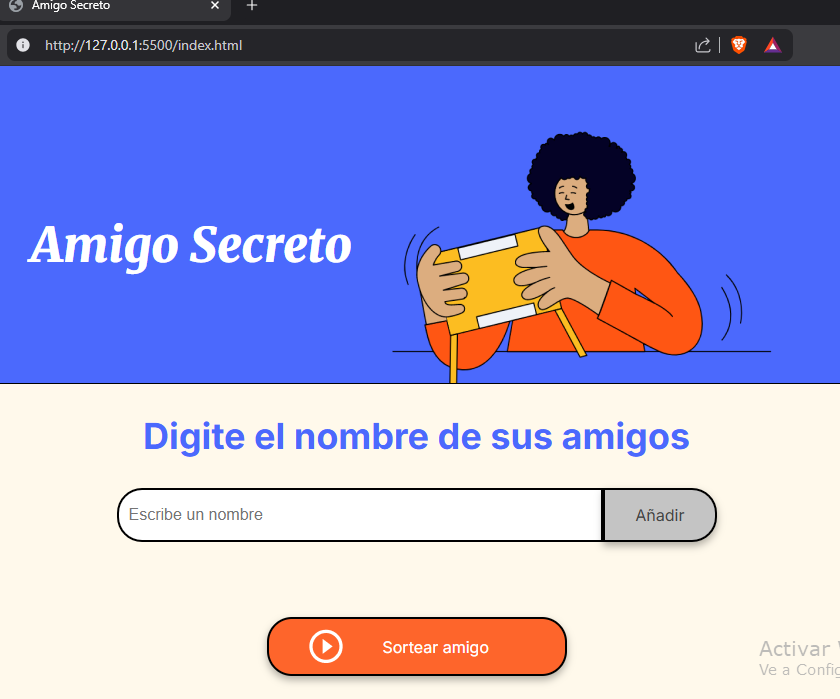
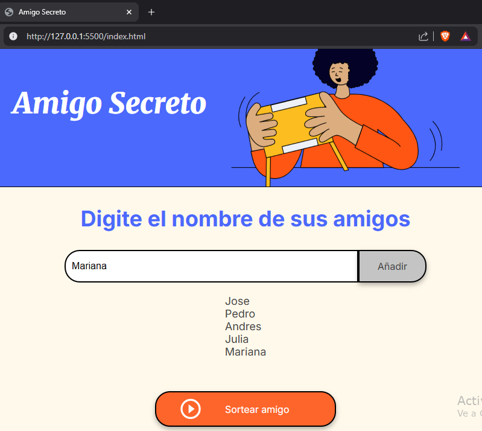
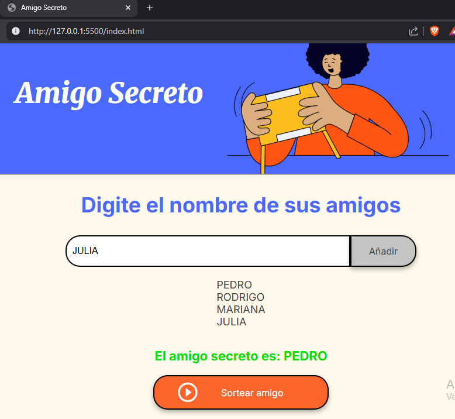

# CHALLENGE- AMIGO SECRETO_ALURA LATAM (ORACLE)
# -----------------Amigo Secreto 🎁------------------

¡Bienvenido al proyecto *Amigo Secreto*! Este es un challenge del curso de *Alura Latam*, donde puse en práctica toda la lógica de programación en **JavaScript**. 

## 🚀 Descripción
Este proyecto es una página web que permite organizar un *Amigo Secreto* de forma sencilla y rápida. Se encarga de hacer el sorteo entre los participantes sin que nadie pueda ver a quién le tocó hasta el momento indicado. 

## ✨ Funcionalidades
- Agregar nombres de participantes.
- Realizar el sorteo aleatorio de manera justa.
- Mostrar los resultados de forma oculta hasta que cada persona lo revele.

## 🛠 Cómo usarlo
1. Abre la página en tu navegador.
2. Ingresa los nombres de los participantes.
3. Haz clic en el botón para realizar el sorteo.
4. Cada participante podrá ver a quién le tocó de manera privada.

## 📚 ¿Dónde encontrar ayuda?
Si tienes alguna duda o encuentras un problema en el código, puedes revisar la documentación de **JavaScript** o preguntar en la comunidad de *Alura Latam*.

## 👨‍💻 Autor
Este proyecto fue desarrollado como parte de mi aprendizaje en lógica de programación con **JavaScript**. 

👤 **RECONER28**

¡Espero que este proyecto te sea útil y te diviertas organizando tu *Amigo Secreto*! 🎉